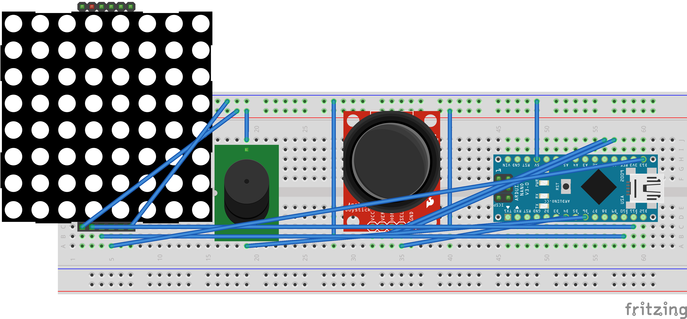

# 🧩 Maze Solver Game (8x8 LED + Joystick + Buzzer)

Navigate your way out of a challenging 8x8 LED maze using a joystick, while "Flight of the Bumblebee" plays in the background on a buzzer. Compact, addictive, and Arduino-powered.

---

## 🎮 Gameplay

- Move your player using the joystick.
- Avoid the walls and find the path to the exit.
- The buzzer plays a simplified version of *Flight of the Bumblebee* on loop.

---

## 🧰 Components

- Arduino Nano
- MAX7219 8x8 LED Matrix
- Joystick Module
- Piezo Buzzer
- Breadboard + Jumper Wires

---

## ⚡ Wiring Diagram

### MAX7219 Matrix → Arduino Nano

| MAX7219 Pin | Arduino Pin |
|-------------|-------------|
| VCC         | 5V          |
| GND         | GND         |
| DIN         | D11         |
| CS          | D10         |
| CLK         | D13         |

### Joystick → Arduino Nano

| Joystick Pin | Arduino Pin |
|--------------|-------------|
| VRx          | A0          |
| VRy          | A1          |
| SW           | D2 (optional) |
| VCC          | 5V          |
| GND          | GND         |

### Buzzer → Arduino Nano

| Buzzer Pin | Arduino Pin |
|------------|-------------|
| +          | D3          |
| -          | GND         |

---

## 🔧 How It Works

- The maze is hardcoded in an 8x8 binary array.
- Movement is smoothed and limited by a delay.
- Only open paths (`0`s) are allowed.
- The buzzer plays tones in sequence to mimic the classic melody.

---

## 🧠 Maze Pattern

Each byte represents one row of the maze (`1` = wall, `0` = path):

